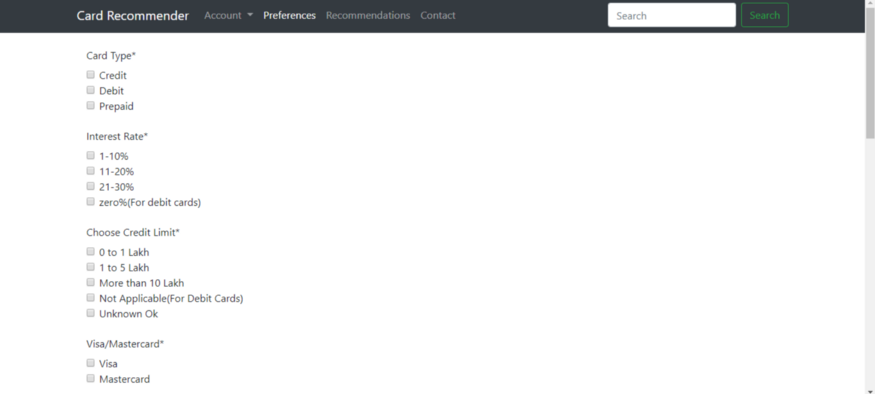
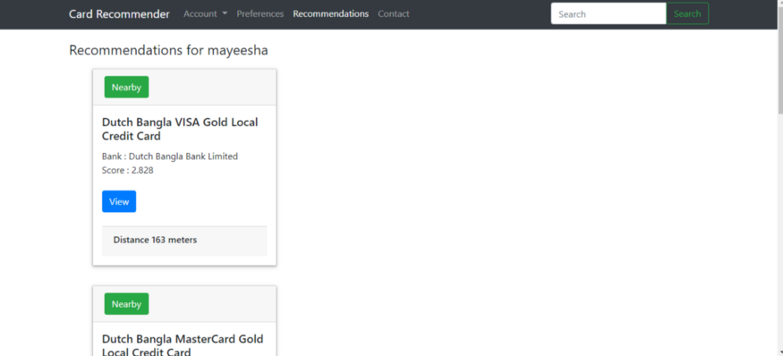

# Post

[Building a Credit Card Recommender with Scikit-Learn and deploying on web and Chatbot](https://medium.com/learning-machine-learning/building-a-credit-card-recommender-and-deploying-on-web-and-chatbot-platform-91bd7baf2798)

# Context

Bangladesh is a developing country whose economy is growing fast. The GDP per capita of Bangladesh has grown to 1516 USD in 2017 compared to 88 USD of 1960. Individuals have more disposable income now and the infrastructure of the country has also improved a lot. Most banks have ATM booths all over the country.

Bangladesh most definitely does not have a cashless economy, but the credit card usage is growing. Grocery super shops, mobile, electronics companies, hotels, resorts, restaurants all offer different sort of discounts based on the card that is being used for payment. Given that , this project focused on making a credit card recommendation system. 

# Model

Cards are recommended based on only card features and use a similarity measure to recommend similar cards per user preference. Apart from the card features, location of the user was also considered. Even if the card preferences matched, the user may not have any nearby offices for the bank in the remote areas of Bangladesh as an agricultural country.

We collected data on 130 cards from 15+ unique banks. Features like card type, interest rate, credit limit, rewards associated with the card etc were collected. Since the bank providers change website design frequently and the data we’re collecting is small, I didn’t scrape the data by choice because writing scraper for all different bank websites would have been time consuming. All information that was collected is public.

# Dataset

The model is a basic nearest neighbor based model trained on scikit-learn which I pickled for deployment. 

For input the model takes in different preferences from the user , the outputs are the recommendation scores and indices from the unsupervised nearest neighbor models.

The location API used was [HERE Technologies](https://www.here.com/) . For showing nearby banks the user inputs the area and the city, HERE API unfortunately is not that precise for countries like Bangladesh. Then the text is geocoded using the HERE geocoding API and the extracted latitude and longitude is used to search through the nearby banks in a given radius.

# Google Dialogflow Integration

Google dialogflow was used for making a chatbot which will recommend credit cards. The dialogflow code uses the same pickled model. 

When a user talks to the chatbot dialogflow assumes the user has some **intent.** In this case we assume the intent is to find a credit or debit card recommendation. The intent can collect data from users with entities.  For example an entity card-type may have multiple values like credit, debit or prepaid. Dialogflow connects with the server via webhook and server returns the recommendations. 

# Chatbot Demo

This is a demo conversation.

