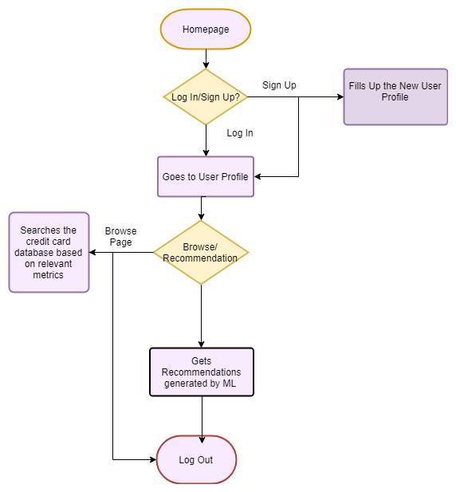

# Software Requirement Specification Document

[TOC]

# 1. Introduction

## 1.1 Purpose

## 1.2 Document Conventions

## 1.3  Intended Audience and Reading Suggestions

## 1.4 Product Scope

## 1.5 References

# 2 Overall Description

## 2.1 Product Perspective

## 2.2 Product Functions

## 2.3 User Classes And Characteristics

The UML diagram for the different user classes is shown below.

## 2.4 Operating Environment 

## 2.5 Design And Implementation Constraints

## 2.6 User Documentation

## 2.7 Assumptions and Dependencies

# 3 External Interface Requirements

## 3.1 User Interfaces

## 3.2 Hardware Interfaces

## 3.3 Software Interfaces 

## 3.4 Communication Interfaces

# 4 System Features And Expanded Use Cases

User workflow diagram given below the typical usage for the system. Expanded use cases are written below with further information.

## 4.1 Use case 1 : Go to Landing Page

Actor : User and Admin.
Type : Primary
Typical Course of Events : 

|                      Actor Actions                       |          System Responses           |
| :------------------------------------------------------: | :---------------------------------: |
| 1. Go to web application home page url via a web browser | 1. Browser serves the landing page. |

## 4.2 Use Case 2 : Logging In 

Actor : User 
Type : Primary
Typical Course of Events : 

|                 Actor Actions                  |                       System Responses                       |
| :--------------------------------------------: | :----------------------------------------------------------: |
|        1. User clicks on Log In Button         | 1. User is shown a form containing username or email and password fields along with forgot password button. |
| 2. User writes the username/email and password |           2. System Redirects to the profile page.           |

Alternative Course Of Events : 

### 4.2.1 Use Case 2.1 : Forgetting Password 

|                Actor Actions                 |                       System Responses                       |
| :------------------------------------------: | :----------------------------------------------------------: |
|       1. User clicks on Log In Button        | 1. User is shown a form containing username or email and password fields along with forgot password button |
| 2. User clicks on the forgot password button | 2. User is sent a email/mobile verification link. Details of how to handle password change will be fixed during implementation of back end. |

## 4.3 Use Case 3 : Sign Up

Actor : User 
Type : Primary
Typical Course Of Events : 

|           Actor Actions            |                   System Responses                    |
| :--------------------------------: | :---------------------------------------------------: |
|  1. User goes to landing page URL  |           1. Browser serves the home page.            |
| 2. User clicks the sign up button. | 2. User is redirected to the create new profile form. |

## 4.4 Use Case 4 : Creating Profile

Actor : User And admin
Type : Primary
Typical Course of Events : 

|                        Actor Actions                         |                       System Responses                       |
| :----------------------------------------------------------: | :----------------------------------------------------------: |
| 1. User clicks sign up and is redirected to the profile form page. | 1. System stores the data given by user for creating new profile. Credit card recommendations will be generated by this information. User is shown buttons for getting recommendations and search. |

## 4.5 Use Case 5 : Get Recommendation 

Actor : User and Admin.
Type : Primary
Typical Course Of Events : 

|                        Actor Actions                         |                       System Responses                       |
| :----------------------------------------------------------: | :----------------------------------------------------------: |
| 1. User clicks get recommendations button from the profile page. | 1. System redirects to the recommendations page where the user is shown a list of recommendations for future purchasing. |

## 4.6 Use Case 6 : Search

Actor : User and Admin.
Type : Primary
Typical Course Of Events : 

|                        Actor Actions                         |                       System Responses                       |
| :----------------------------------------------------------: | :----------------------------------------------------------: |
| 1. User clicks the search page from website after logging in or signing up. | 1. System shows user the search page when they can search the credit card database through different search criterias. |

## 4.7 Use Case 7 : Sign Out

Actor : User 
Type : Primary
Typical Course Of Events : 

|            Actor Actions            |       System Responses        |
| :---------------------------------: | :---------------------------: |
| 1. User Signs out from the profile. | 1. System signs out the user. |

## 4.8 Use Case 8 : Administrator Usage actions

### 4.8.1 Use Case 8.1 : Adding Credit Card

Actor : Admin
Type : Primary
Typical Course Of Events : 

|                        Actor Actions                         |             System Response              |
| :----------------------------------------------------------: | :--------------------------------------: |
| 1. Admin logs in as admin and clicks on adding credit card button from profile. | 1. Form for adding credit card is shown. |
|         2. Admin fills up the card information form.         |     2. Card is added to the system.      |

### 4.8.2 Use Case 8.2 : Deleting Credit Card 

Actor : Admin
Type : Primary
Typical Course Of Events : 

|                        Actor Actions                         |                       System Response                        |
| :----------------------------------------------------------: | :----------------------------------------------------------: |
| 1. Admin logs in as admin and clicks on deleting credit card button from profile. | 1. List of credit cards in the system is shown for deletion. |
|          2. Admin selects the cards to be deleted.           |         2. Card is deleted from the system database.         |

### 4.8.3 Use Case 8.3 : Edit Credit Card 

Actor : Admin
Type : Primary
Typical Course Of Events : 

|                        Actor Actions                         |                       System Response                       |
| :----------------------------------------------------------: | :---------------------------------------------------------: |
| 1. Admin logs in as admin and clicks on edit  card button from profile. | 1. List of credit cards in the system is shown for editing. |
|           2. Admin selects the cards to be edited.           |                     2. Card is edited.                      |

### 4.8.4 Use Case 8.4 : Administrator Log In/Sign Out

Actor : Admin
Type : Primary
Typical Course Of Events : 

|                 Actor Actions                 |                       System Response                        |
| :-------------------------------------------: | :----------------------------------------------------------: |
| 1. Admin logs in as admin from the home page. | 1. Admin is able to do admin privileged actions like adding, removing, editing credit cards. Admin can also do everything a user can do like getting recommendations and search. |
|              2. Admin signs out.              |           2.  Admin is signed out from the system.           |

## 4.9 System Feature 1 : Send Notifications

Actor : System
Type : Primary
Typical Course Of Events 

| Actor Actions | System Responses |
| :-----------: | :--------------: |
|               |                  |

# 5 Other Non Functional Requirements

## 5.1 Performance Requirements

Performance requirements depend on the machine learning model use. Right now as the database is small we are using content based recommendations for bangladeshi credit cards, but most likely a collaborative filtering model will be used for better performance after getting more users. Since it depends heavily on the implementation performance requirement details will be fixed later.

## 5.2 Safety Requirements

Not Applicable as the system only shows recommendations for financial products.

## 5.3 Security Requirements

Not applicable as the system does not store much confidential data about the user such as credit card information.

## 5.4 Software Quality Attributes 

Software should be fast with an intuitive user interface for financially less-literate users.

## 5.5 Business Rules

Not applicable as the recommendation system is not doing any explicit business with any bank at this moment.

# Appendix A :  Selection of Banks being considered for recommendation.

# Appendix B : A selection of potential credit cards being considered for recommendation.

